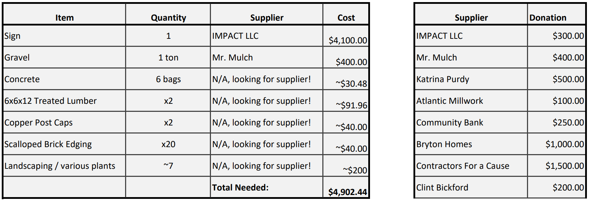
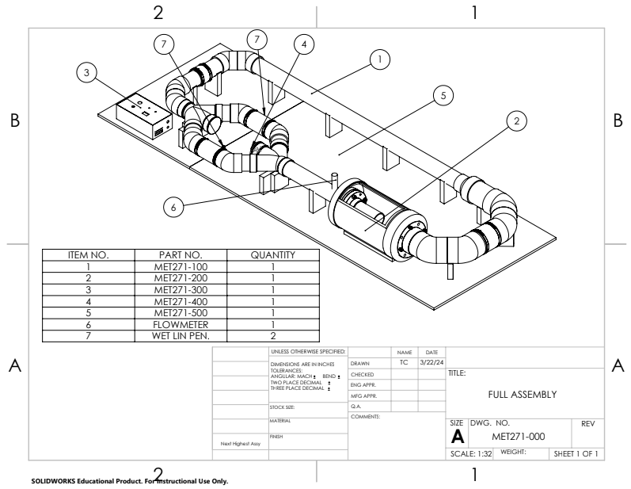
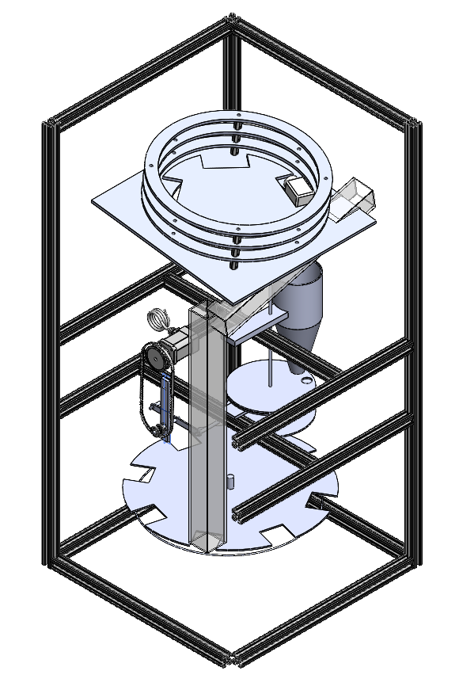

# Portfolio
## 1. Who Am I?
My name is Dalton Facer, I have earned my Associates in Applied Sciences Degree from Delaware Terchnical Community College, and I am currently an Undergraduate Mechanical Engineering Student in the College of Engineering at the University of Delaware. 
I have acquired experience in Construction, Woodworking, CNC and Manual Machining, Addative Manufacturing, and Home Projects, as well as digital design experience with programs such as Revit, AutoCAD, Solidworks, OnShape, C++, and Python.

    

## 2. Projects

### Camp Barnes Eagle Project
Scouting has played a crucial role in shaping the man I have become today, as much of my childhood was spent going on camping trips, completing Merit Badges, and into my early adult life, leading a Troop of other young adults whom I would inspire. The completion of my Eagle Project, the fundraising and construction of a waterfront sign for Camp Barnes in Selbyville, DE, is an achievement I take much pride in.

     
    Eagle Project: Camp Barnes Waterfront Sign

My father was the Scoutmaster for most of the time I was in the scouting, and for alot of that time he would keep a hands-off approach. He would allow the boys to problem solve on their own and to justify their decisions whilst working out disputes. While I was working on my eagle project, he kept this approach. He gave suggestions but did not at any point take control of my project. It allowed me face the chalenge with my own two hands. 

     
    Fundraiser

Through this experience, I gained valuable skills in advertising and fundraising, designing, promoting the project, assembling a team of volunteers, scheduling, and leading the construction process. I had began fundraising for this project around the time that COVID hit, which caused for price inflations and longer wait times. This was a big hurdle which delayed the project, but it was one that I would eventually overcome.

     
    Project Totals

        
The project was in total around $4,900, all of which I did the promotion and fundraising for, including fundraising at local banks, collaborating with local businesses, and speaking in front of a nonprofit organization of local contractors, Contractors for a Cause.

### Delaware Tech Machined Compressed Air Engine

This project involved designing and machining a compressed air engine from scratch. I contributed by machining the air-piston cylinder and helping assemble the functional prototype. This required precision CNC and manual machining, technical drawings, and hands-on teamwork.

     
    Designated Compressed Air Engine Cam

     
    Compressed Air Engine Cam Technical Drawing

     
    Compressed Air Engine Operational Prototype Assembly

Once we constructed a working prototype, we made 13 more full assemblies. Each member of the team acquired an operational Air-Piston Cylinder.

### Delaware Tech Engineering Project: Drag Testing Lab Equipment
In my Engineering project class, we were assigned with designing drag testing equipment. The fluids lab was in need of a tool for demonstrating the coefficient of drag equation, so we developed a fluid loop powered by two electric thrusters.

     
    Drag Testing Equipment Drawing

In order to determine the coefficient of drag on an object, we need the density of the fluid, the reference area of the object, the force applied to the object, and the velocity of the fluid. With our design, we measure the force of drag on the object with a load cell, and can find the fluid velocity with the flow rate in the tubing.

     
    Drag Testing Equipment Assembly

This entire project needed to be waterproofed, transportable, and easy to operate, so we made sure to put the proper measures in place to ensure ease of use and to maximize safety.

### Automated Pharmaceutical Packaging Line

I am currently attending University of Delaware and am working with a team of engineers to finalize the front station of a Pharmaceutical Packaging Line. It will automatically orient pill bottles upright, fill them with exactly 30 pills, weigh and reject the bottles with too many or too little pills, and transition the bottles to the back station, which puts the caps on the bottles, screws them on, and collects them at the end.

     
    Automated Pharmaceutical Packaging Line CAD

This system must be accurate and consistent, as in the real world, providing someone with the incorrect ammount of medication would be dangerous, if not lethal.
We have completed the assembly of this processing line, and are currently working on perfecting each susbsystem, and calibrating the automation process.

     
    Automated Pharmaceutical Packaging Line

This system will be fully operational in early may, and will ideally work consistently and fully-autonomously.

### Home Projects

My dad and I have worked on a multitude of home construction projects. Our largest one to date is a rear extension. A back patio with a pergola, an outddoor kitchen, and soon enough, a pizza oven.
(Insert Image Here)
While I have not worked in construction for a few years now, I have still had some time to work on this project, as well as renovating our basement. With this I have gained experience with interior electrical work, and have applied my knowledge from working at StudioJAED

## 3. Skills

### Manufacturing, CAD, and Simulation
Prototyping, Designing, and Manufacturing are all things that I have acquired extensive training with in my edcation, work, and home projects.

### Leadership (Eagle + Outstanding Graduate + Collaboration with Separate Groups)
I have had many oppertunities to demonstrate my leadership in both Scouting and College. I believe my experience has helped me become a well-rounded, professional engineer who takes pride in his work.

### Professionalism

In my Engineering and my leadership, I pride myself in my tendancy to be punctual, and to strive for maximal proficiency. I put in the utmost effort to have a deep-seated understanding of all facets of my work. This dedication fuels my excitement for learning and continuous improvement. This perspective derives itself from my love for playing the piano, an art that demands discipline, precision, and creativity. The parallels between my passions and proficiencies often shape my decision-making process. I tend to think in comparisons and metaphors, taking ideas from one area and applying them in another to see things from a new angle or come up with creative solutions.

## 4. Work and Internship Experience | Certifications and Training

### StudioJAED

I was a mechanical designer for StudioJAED in Bear, DE from the summer of 2023 to present. As a mechanical designer for Studio JAED, I designed Mechanical, Plumbing, and Electrical (MEP) plans for schools, labs, and governmental buildings. I created new work MEP plans for John G. Leach School, renovation plans for William Penn HS and the Wilmington DMV, and conducted surveys at many Colonial School District educational facilities and the Legislative Hall in Dover, DE.

### Rogan Custom Construction

I worked with a home renovation contractor, Pete Rogan with Rogan Custom Construction in the summer of 2022. I learned how to use general hand tools such as a hammer, tape measure, and chalk line. I acquired experience using power tools such as circular saws, reciprocating saws, and framing/nail guns. I performed installations and repairs for windows, wood and tile flooring, doors, and shingles. All of these skills I have used in home projects and in some of my college engineering classes.

### CPR Delaware

Before I began my pursuit of engineering, I was an assistant instructor for CPR Delaware, where I instructed, guided, and trained hundreds of Healthcare Professionals in proper CPR compressions and breaths at community centers across Sussex County. Here, I acquired CPR and AED certification which was valuable experience for when I was a lifeguard in the summer of 2023.

## 5. Contact Information

    Email: Dalton.J.Facer@gmail.com 
    Phone: (302)-604-0761

