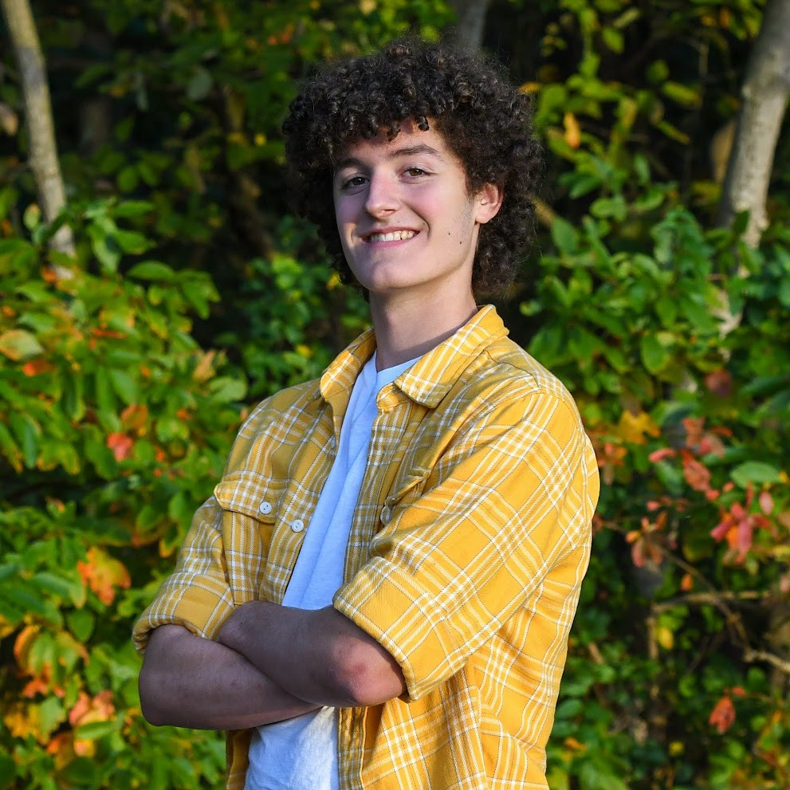
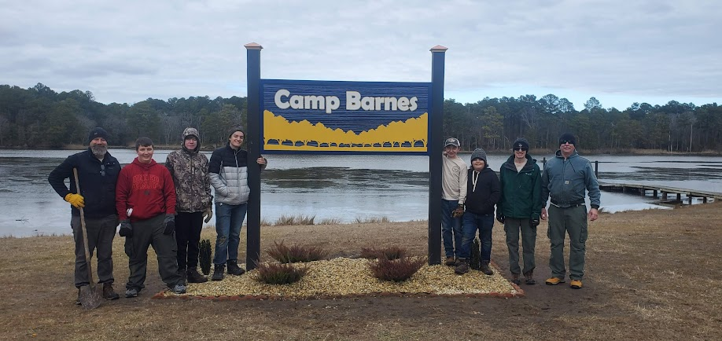

# Portfolio
## 1. Who Am I?
My name is Dalton Facer, I have earned my Associates in Applied Sciences Degree from Delaware Terchnical Community College, and I am currently an Undergraduate Mechanical Engineering Student in the College of Engineering at the University of Delaware. 
I have acquired experience in Construction, Woodworking, CNC and Manual Machining, Addative Manufacturing, and Home Projects, as well as digital design experience with programs such as Revit, AutoCAD, Solidworks, OnShape, C++, and Python.

    

## 3. Projects

### Hammer

### Camp Barnes Eagle Project

    

    Eagle Project: Camp Barnes Waterfront Sign

### Machined compressed air engine

### Drag Testing Lab Equipment

### Automated Pharmaceutical Packaging Line

## 3. Skills

### Prototyping & Fabrication
"(Showcase your experience with machining, 3D printing, and physical builds.)"
### Technical Expertise
"(Showcase your experience with implementing designed parts.)"
### Strategic Problem-Solving
"(Provide a few examples)"
---
### Revit/AutoCAD
### Solidworks
### C++ and Python
---
### Collaborative Engineering & Teamwork
### Hands-On Leadership
### Certifications & Professional Development

## 4. Work and Internship Experience | Certifications and Training

### StudioJAED
### Rogan Custom Construction
### CPR Delaware

## 5. Resume & Contact Information
