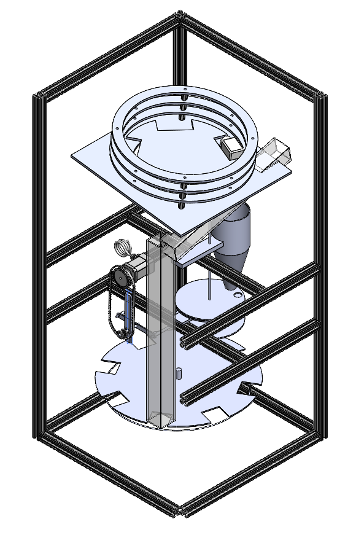
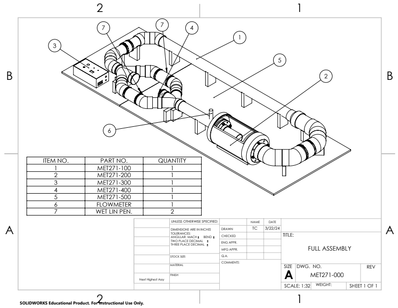
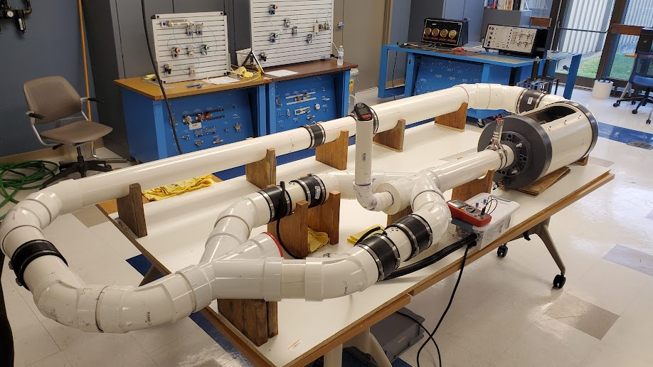
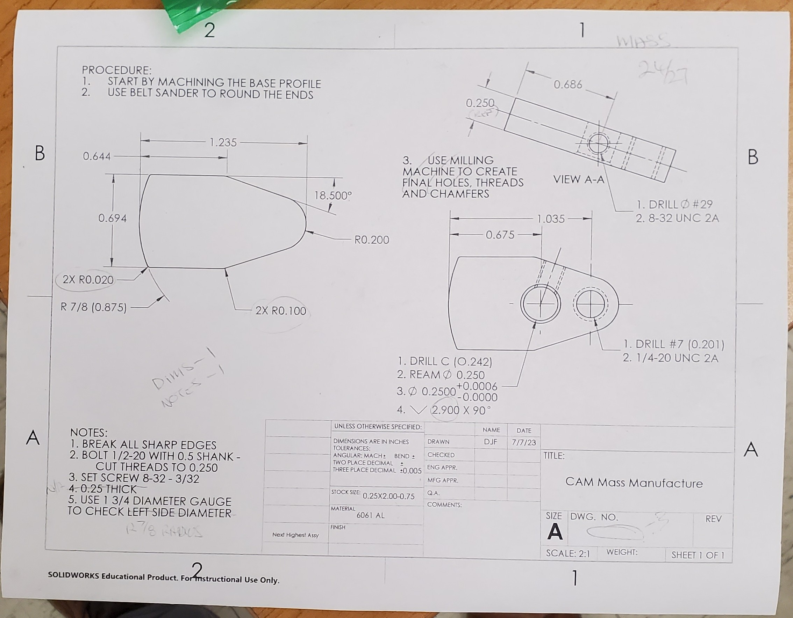
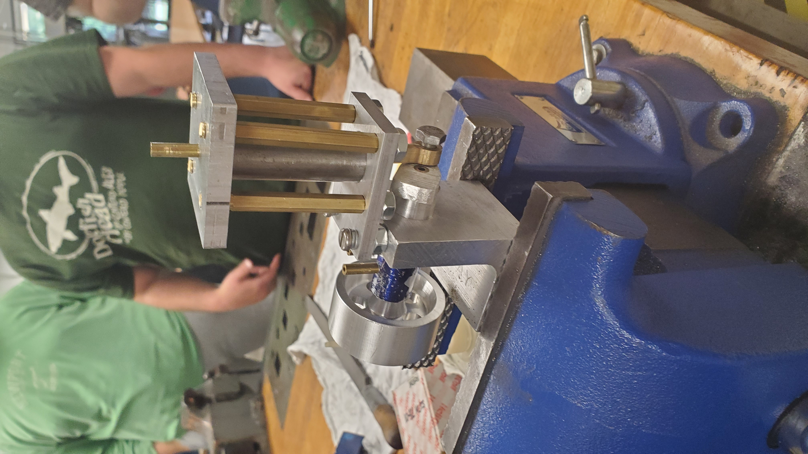
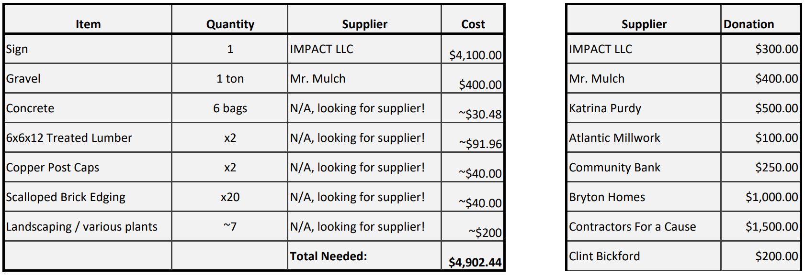

# Mechanical Engineer

#### Technical Skils: Solidworks, AutoCAD, Revit, Python, C++, MatLAB.

# Education
- A.A.S., Mechanical Engineering Technology | Delaware Technical Community College (_May 2024_)
- M.S., Mechanical Engineering	            | The University of Delaware (_December 2026_)

## Work Experience
**Mechanical Engineering Intern @ StudioJAED (_June 2023 - Present_)**
- Designed Mechanical, Plumbing, and Electrical (MEP) plans for schools, labs, and governmental buildings.
- Conducted surveys at many Colonial School District educational facilities and the Legislative Hall in Dover, DE.

**Carpenter @ Rogan Custom Construction (_May 2022 - August 2022_)**
- Constructed a shed, and a rear extension with a porch.
- Gained experience using power tools such as circular saws, reciprocating saws, and framing/nail guns

## Projects

### Automated Pharmaceutical Packaging Line

I am currently attending University of Delaware. For a Junior Design project last year, me and a team of mechanical engineering students were tasked with designing, manufacturing, and automating the front station of a Pharmaceutical Packaging Line while following all design and manufacturing best practices. 

     
    Automated Pharmaceutical Packaging Line CAD

The system was designed for simplicity, where pill bottles are dumped into one point, pills are dumped into another, and the system must orient the pill bottles upright, fill them with exactly 30 pills, validate each bottle after filling and reject the bottles with too many or too little pills, and finally transition the bottles to the back station, which puts the caps on the bottles, screws them on, and performs a final validation step.

     
    Automated Pharmaceutical Packaging Line

This system operated consistently and fully-autonomously upon completion. The experience taught me a lot about proper part design for ease of access and installation, custom-made device calibration, full-system coding logic in C++, and overall collaboration on greater engineering assemblies.

### Delaware Tech Engineering Project: Drag Testing Lab Equipment
In my Engineering project class, we were assigned with designing drag testing equipment. The fluids lab was in need of a tool for demonstrating the coefficient of drag equation, so we developed a fluid loop powered by two electric thrusters.

     
    Drag Testing Equipment Drawing

In order to determine the coefficient of drag on an object, we need the density of the fluid, the reference area of the object, the force applied to the object, and the velocity of the fluid. With our design, we measure the force of drag on the object with a load cell, and can find the fluid velocity with the flow rate in the tubing.

     
    Drag Testing Equipment Assembly

This entire project needed to be waterproofed, transportable, and easy to operate, so we made sure to put the proper measures in place to ensure ease of use and to maximize safety.

### Delaware Tech Machined Compressed Air Engine

This project involved designing and machining a compressed air engine from scratch. I contributed by machining the air-piston cylinder and helping assemble the functional prototype. This required precision CNC and manual machining, technical drawings, and hands-on teamwork.

     
    Designated Compressed Air Engine Cam

     
    Compressed Air Engine Cam Technical Drawing

     
    Compressed Air Engine Operational Prototype Assembly

Once we constructed a working prototype, we made 13 more full assemblies. Each member of the team acquired an operational Air-Piston Cylinder.

### Camp Barnes Eagle Project
Scouting has played a crucial role in shaping the man I have become today, as much of my childhood was spent going on camping trips, completing Merit Badges, and into my early adult life, leading a Troop of other young adults whom I would inspire. The completion of my Eagle Project, the fundraising and construction of a waterfront sign for Camp Barnes in Selbyville, DE, is an achievement I take much pride in.

     
    Eagle Project: Camp Barnes Waterfront Sign

My father was the Scoutmaster for most of the time I was in the scouting, and for alot of that time he would keep a hands-off approach. He would allow the boys to problem solve on their own and to justify their decisions whilst working out disputes. While I was working on my eagle project, he kept this approach. He gave suggestions but did not at any point take control of my project. It allowed me face the chalenge with my own two hands. 

     
    Fundraiser

Through this experience, I gained valuable skills in advertising and fundraising, designing, promoting the project, assembling a team of volunteers, scheduling, and leading the construction process. I had began fundraising for this project around the time that COVID hit, which caused for price inflations and longer wait times. This was a big hurdle which delayed the project, but it was one that I would eventually overcome.

     
    Project Totals

        
The project was in total around $4,900, all of which I did the promotion and fundraising for, including fundraising at local banks, collaborating with local businesses, and speaking in front of a nonprofit organization of local contractors, Contractors for a Cause.

## Contact Information

    Email: Dalton.J.Facer@gmail.com 
    Phone: (302)-604-0761
