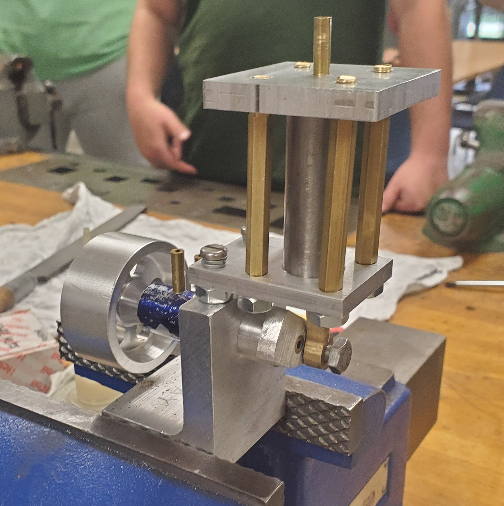

# Portfolio
## 1. Who Am I?
My name is Dalton Facer, I have earned my Associates in Applied Sciences Degree from Delaware Terchnical Community College, and I am currently an Undergraduate Mechanical Engineering Student in the College of Engineering at the University of Delaware. 
I have acquired experience in Construction, Woodworking, CNC and Manual Machining, Addative Manufacturing, and Home Projects, as well as digital design experience with programs such as Revit, AutoCAD, Solidworks, OnShape, C++, and Python.

    

## 3. Projects

### Camp Barnes Eagle Project
Scouting has played a crucial role in shaping the man I have become today, as much of my childhood was spent going on camping trips, completing Merit Badges, and into my early adult life, leading a Troop of other young adults whom I would inspire. The completion of my Eeagle Project is an achievement I take much pride in.

    

    Eagle Project: Camp Barnes Waterfront Sign

My father was the Scoutmaster for most of the time I was in the scouting, and for alot of that time he would keep a hands-off approach. He would allow the boys to problem solve on their own and to justify their decisions whilst working out disputes. While I was working on my eagle project, he kept this approach. He gave suggestions but did not at any point take control of my project. It allowed me face the chalenge with my own two hands. 

    

    Fundraiser

Through this experience, I gained valuable skills in advertising and fundraising, designing, promoting the project, assembling a team of volunteers, scheduling, and leading the construction process. I had began fundraising for this project around the time that COVID hit, which caused for price inflations and longer wait times. This was a big hurdle which delayed the project, but it was one that I would eventually break past.

    
    <"Fundraiser">

The project was in total around $5,000, all of which I did the promotion and fundraising for.

    

    Team Behind Construction

### Machined compressed air engine

This project involved designing and machining a compressed air engine from scratch. I contributed by machining the air-piston cylinder and helping assemble the functional prototype. This required precision CNC and manual machining, technical drawings, and hands-on teamwork.

    

    My Air-Piston Cylinder Part

    

    Air-Piston Cylinder Technical Drawing

    

    Air-Piston Cylinder Operational Prototype Assembly

### Drag Testing Lab Equipment

    

    Eagle Project: Camp Barnes Waterfront Sign

### Automated Pharmaceutical Packaging Line

    

    Automated Pharmaceutical Packaging Line

### Hammer

## 3. Skills

### Prototyping & Fabrication
"(Showcase your experience with machining, 3D printing, and physical builds.)"
### Technical Expertise
"(Showcase your experience with implementing designed parts.)"
### Strategic Problem-Solving
"(Provide a few examples)"
---
### Revit/AutoCAD
### Solidworks
### C++ and Python
---
### Collaborative Engineering & Teamwork
### Hands-On Leadership
### Certifications & Professional Development

## 4. Work and Internship Experience | Certifications and Training

### StudioJAED
### Rogan Custom Construction
### CPR Delaware

## 5. Resume & Contact Information
